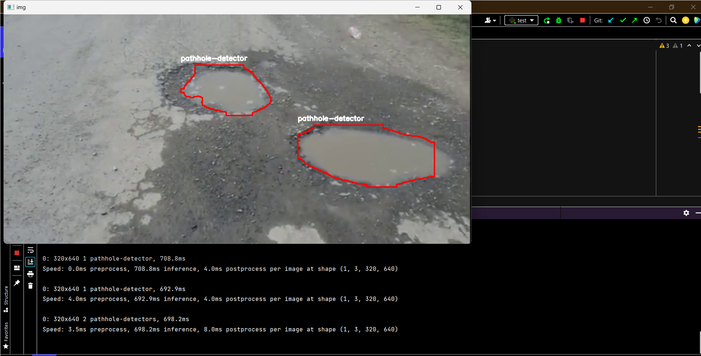

# Pothole Detector

This is a project for detecting potholes in videos using a YOLO model.

Example Output


## Requirements

- Python 3.x
- OpenCV
- PyTorch
- Ultralytics YOLO

## Usage

1. Install the required libraries.
2. Run the script `pothole_detector.py` to process the video and detect potholes.

## Installation

```bash
pip install -r requirements.txt


# to run the project 
python pothole_detector.py
